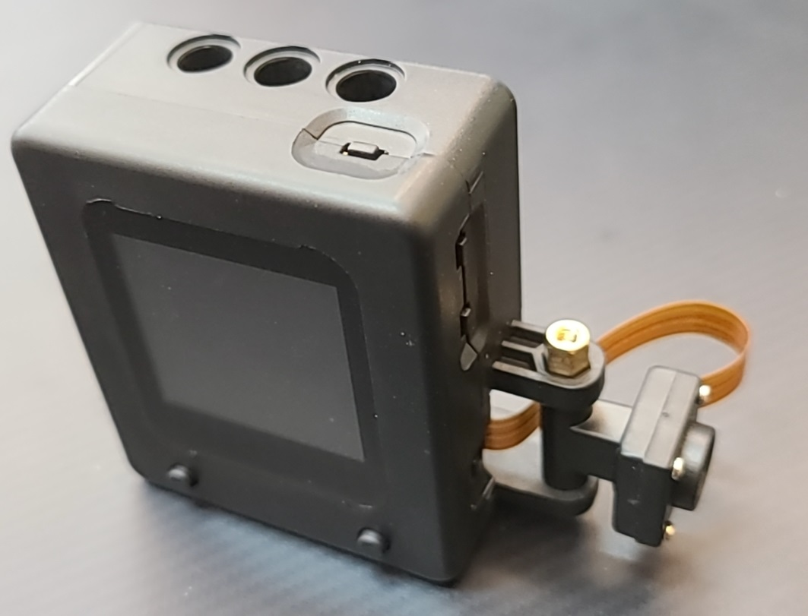
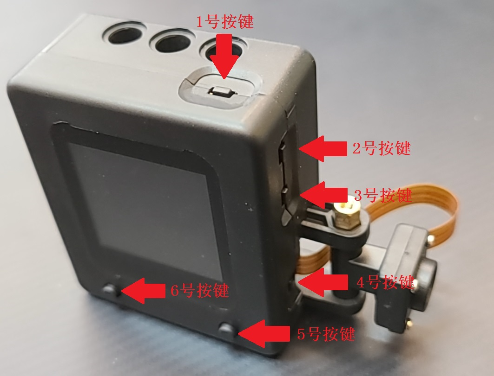
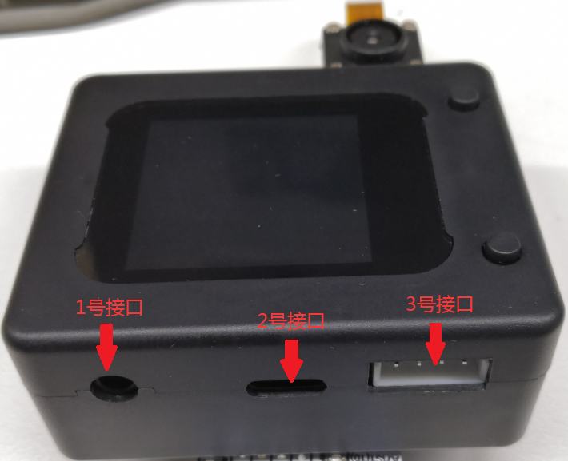

# AI模块

## 简述

AI视觉语音控制模块基于全志V831设计，大容量TF卡拓展，支持python编程语言可以轻松处理各类场景中的人工智能算法。硬件上集成1.54寸的240x240分辨率高清LCD屏幕、200万像素180°灵活旋转的OV2685摄像头、1.5瓦的扬声器、麦克风，具备机器听觉与机器视觉两种能力，可以灵活适配人脸识别、目标检测、语音唤醒及识别等场景。外设包含type-C串口程序下载接口及4P座串口通讯接口，可轻松实现程序下载和与人工智能开源控制器通讯功能，拥有图形可视化操作固件和6个用户交互按键，帮助使用人员更快上手开发人工智能项目。

## 按键说明

|  编号   |     说明      |
| :-----: | :-----------: |
| 1号按键 | 确认选择/推出 |
| 2号按键 |    下一个     |
| 3号按键 |    上一个     |
| 4号按键 |     重启      |
| 5号按键 | 翻转屏幕/确认 |
| 6号按键 | 切换功能/返回 |

## 接口说明

|  编号   |   说明   |
| :-----: | :------: |
| 1号接口 |    无    |
| 2号接口 | 固件下载 |
| 3号接口 | 通信接口 |

## 模块功能

1、人脸检测
2、图像学习
3、道路识别
4、人脸识别学习
5、颜色检测
6、颜色学习识别
7、标签识别
8、手势识别
9、交通标志识别
10、语音识别

## 使用说明

> STM32主控
1.连接AI摄像头与主控需要使用一条4P端子转4P杜邦线，端子一头接AI摄像头3号接口，杜邦线一头接主控上对应的引脚。
2.在提供的软件中搭建图形化代码，实现在主控中控制AI摄像头模块功能，并在主控显示屏上显示AI摄像头识别到的图像ID。
